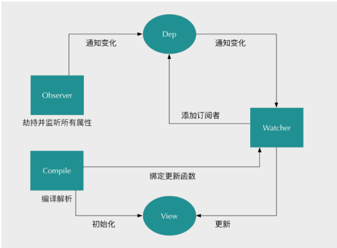
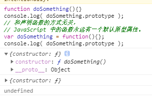
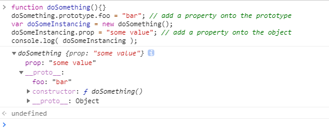
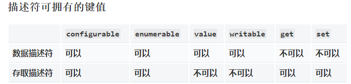

# 参考地址

[地址1](https://juejin.im/entry/6844903479044112391)

[地址2](https://segmentfault.com/a/1190000006599500#articleHeader6)

[地址3](https://developer.mozilla.org/zh-CN/docs/Web/JavaScript/Reference/Global_Objects/Object/defineProperty)

# 双向绑定实现原理

数据劫持+发布&订阅

> 要实现双向绑定有2个条件

- 劫持数据
- 进行监听


```
设置一个监听器 Observer，用来监听所有属性

属性变化，通知 watcher(订阅者：有多个) 看是否更新。由于有多个订阅者，所以用一个消息订阅器 Dep 来统一管理；在监听器Observer和订阅者Watcher之间进行统一管理的。

指令解析器 Compile,对每一个节点元素进行扫描解析，将相关的指定对应初始化为一个 Watcher(订阅者)；并且替换模板数据或者绑定相应的函数；
当 Watcher(订阅者)接受到相应的属性变化，就会执行对应的更新函数，进而更新视图。
```

> 总结：Watcher 订阅 Observer，执行更新；Observer 监听属性，通知Watcher；Compile 初始化模板数据和相应的Watcher

- 实现一个监听器Observer，用来劫持并监听所有属性，如果有变动的，就通知订阅者。

- 实现一个订阅者Watcher，可以收到属性的变化通知并执行相应的函数，从而更新视图。

- 实现一个解析器Compile，可以扫描和解析每个节点的相关指令，并初始化模板数据以及初始化相应的订阅器。




# 前置知识

## 原型链

[Object.prototype](https://developer.mozilla.org/zh-CN/docs/Web/JavaScript/Inheritance_and_the_prototype_chain)

[Object.defineProperty()](https://developer.mozilla.org/zh-CN/docs/Web/JavaScript/Reference/Global_Objects/Object/defineProperty)

> 核心方法是`Object.defineProperty( )` .如果要对所有属性都进行监听的话，那么可以通过递归方法遍历所有属性值，并对其进行Object.defineProperty( )处理

> 对于使用过基于类的语言 (如 Java 或 C++) 的开发人员来说，JavaScript 有点令人困惑，因为它是动态的，并且本身不提供一个 class 实现。

> 继承时，JavaScript 只有一种结构：对象。每个实例对象（ object ）都有一个私有属性（称之为 `__proto__` ）指向它的`构造函数的原型对象（prototype ）`。
> 该原型对象也有一个自己的原型对象(`__proto__` ) ，层层向上直到一个对象的原型对象为 null。根据定义，null 没有原型，并作为这个原型链中的最后一个环节.`几乎所有 JavaScript 中的对象都是位于原型链顶端的 Object 的实例。`



## 基于原型链的继承


### 继承属性

- JavaScript 对象是动态的属性“包”（指其自己的属性）。
- JavaScript 对象有一个指向一个原型对象的链。
- 当试图访问一个对象的属性时，它不仅仅在该对象上搜寻，还会搜寻该对象的原型，以及该对象的原型的原型，依次层层向上搜索，直到找到一个名字匹配的属性或到达原型链的末尾。

```javascript
// 让我们从一个函数里创建一个对象o，它自身拥有属性a和b的：
let f = function () {
   this.a = 1;
   this.b = 2;
}
/* 这么写也一样
function f() {
  this.a = 1;
  this.b = 2;
}
*/
let o = new f(); // {a: 1, b: 2}

// 在f函数的原型上定义属性
f.prototype.b = 3;
f.prototype.c = 4;

// 不要在 f 函数的原型上直接定义 f.prototype = {b:3,c:4};这样会直接打破原型链
// o.[[Prototype]] 有属性 b 和 c
//  (其实就是 o.__proto__ 或者 o.constructor.prototype)
// o.[[Prototype]].[[Prototype]] 是 Object.prototype.
// 最后o.[[Prototype]].[[Prototype]].[[Prototype]]是null
// 这就是原型链的末尾，即 null，
// 根据定义，null 就是没有 [[Prototype]]。

// 综上，整个原型链如下: 

// {a:1, b:2} ---> {b:3, c:4} ---> Object.prototype---> null

console.log(o.a); // 1
// a是o的自身属性吗？是的，该属性的值为 1

console.log(o.b); // 2
// b是o的自身属性吗？是的，该属性的值为 2
// 原型上也有一个'b'属性，但是它不会被访问到。
// 这种情况被称为"属性遮蔽 (property shadowing)"

console.log(o.c); // 4
// c是o的自身属性吗？不是，那看看它的原型上有没有
// c是o.[[Prototype]]的属性吗？是的，该属性的值为 4

console.log(o.d); // undefined
// d 是 o 的自身属性吗？不是，那看看它的原型上有没有
// d 是 o.[[Prototype]] 的属性吗？不是，那看看它的原型上有没有
// o.[[Prototype]].[[Prototype]] 为 null，停止搜索
// 找不到 d 属性，返回 undefined
```

### 继承方法

- JavaScript 并没有其他基于类的语言所定义的“方法”。在 JavaScript 里，任何函数都可以添加到对象上作为对象的属性。
- 函数的继承与其他的属性继承没有差别，包括上面的“属性遮蔽”（这种情况相当于其他语言的方法重写）。
- 当继承的函数被调用时，this 指向的是当前继承的对象，而不是继承的函数所在的原型对象。

```javascript
var o = {
  a: 2,
  m: function(){
    return this.a + 1;
  }
};

console.log(o.m()); // 3
// 当调用 o.m 时，'this' 指向了 o.

var p = Object.create(o);
// p是一个继承自 o 的对象

p.a = 4; // 创建 p 的自身属性 'a'
console.log(p.m()); // 5
// 调用 p.m 时，'this' 指向了 p
// 又因为 p 继承了 o 的 m 函数
// 所以，此时的 'this.a' 即 p.a，就是 p 的自身属性 'a'
```

## 在 JavaScript 中使用原型

> 在 JavaScript 中，函数（function）是允许拥有属性的。所有的函数会有一个特别的属性 —— prototype


```javascript

function doSomething(){}
doSomething.prototype.foo = "bar";
console.log( doSomething.prototype );
// 和声明函数的方式无关，
// JavaScript 中的函数永远有一个默认原型属性。
var doSomething = function(){};
console.log( doSomething.prototype );

// 可以通过new操作符来创建基于这个原型对象的doSomething实例。使用new操作符，只需在调用doSomething函数语句之前添加new。这样，便可以获得这个函数的一个实例对象。一些属性就可以添加到该原型对象中
function doSomething(){}
doSomething.prototype.foo = "bar"; // add a property onto the prototype
var doSomeInstancing = new doSomething();
doSomeInstancing.prop = "some value"; // add a property onto the object
console.log( doSomeInstancing );


function doSomething(){}
doSomething.prototype.foo = "bar";
var doSomeInstancing = new doSomething();
doSomeInstancing.prop = "some value";
console.log("doSomeInstancing.prop:      " + doSomeInstancing.prop);
console.log("doSomeInstancing.foo:       " + doSomeInstancing.foo);
console.log("doSomething.prop:           " + doSomething.prop);
console.log("doSomething.foo:            " + doSomething.foo);
console.log("doSomething.prototype.prop: " + doSomething.prototype.prop);
console.log("doSomething.prototype.foo:  " + doSomething.prototype.foo);
```




## 创建对象和生成原型链

### 使用语法结构创建的对象

```javascript
var o = {a: 1};

// o 这个对象继承了 Object.prototype 上面的所有属性
// o 自身没有名为 hasOwnProperty 的属性
// hasOwnProperty 是 Object.prototype 的属性
// 因此 o 继承了 Object.prototype 的 hasOwnProperty
// Object.prototype 的原型为 null
// 原型链如下:
// o ---> Object.prototype ---> null

var a = ["yo", "whadup", "?"];

// 数组都继承于 Array.prototype 
// (Array.prototype 中包含 indexOf, forEach 等方法)
// 原型链如下:
// a ---> Array.prototype ---> Object.prototype ---> null

function f(){
  return 2;
}

// 函数都继承于 Function.prototype
// (Function.prototype 中包含 call, bind等方法)
// 原型链如下:
// f ---> Function.prototype ---> Object.prototype ---> null
```

### 使用构造器创建的对象

> 在 JavaScript 中，构造器其实就是一个普通的函数。当使用 new 操作符 来作用这个函数时，它就可以被称为构造方法（构造函数）。

```javascript
function Graph() {
  this.vertices = [];
  this.edges = [];
}

Graph.prototype = {
  addVertex: function(v){
    this.vertices.push(v);
  }
};

var g = new Graph();
// g 是生成的对象，他的自身属性有 'vertices' 和 'edges'。
// 在 g 被实例化时，g.[[Prototype]] 指向了 Graph.prototype。
```

### 使用 Object.create 创建的对象

> ECMAScript 5 中引入了一个新方法：Object.create()。可以调用这个方法来创建一个新对象。新对象的原型就是调用 create 方法时传入的第一个参数


```javascript
var a = {a: 1}; 
// a ---> Object.prototype ---> null

var b = Object.create(a);
// b ---> a ---> Object.prototype ---> null
console.log(b.a); // 1 (继承而来)

var c = Object.create(b);
// c ---> b ---> a ---> Object.prototype ---> null

var d = Object.create(null);
// d ---> null
console.log(d.hasOwnProperty); // undefined, 因为d没有继承Object.prototype
```

### 使用 class 关键字创建的对象

> ECMAScript6 引入了一套新的关键字用来实现 class。使用基于类语言的开发人员会对这些结构感到熟悉，但它们是不同的。JavaScript 仍然基于原型。这些新的关键字包括 class, constructor，static，extends 和 super

```javascript
"use strict";

class Polygon {
  constructor(height, width) {
    this.height = height;
    this.width = width;
  }
}

class Square extends Polygon {
  constructor(sideLength) {
    super(sideLength, sideLength);
  }
  get area() {
    return this.height * this.width;
  }
  set sideLength(newLength) {
    this.height = newLength;
    this.width = newLength;
  }
}

var square = new Square(2);
```


## Object.defineProperty()

> Object.defineProperty() 方法会直接在一个对象上定义一个新属性，或者修改一个对象的现有属性，并返回此对象。

`备注：应当直接在 Object 构造器对象上调用此方法，而不是在任意一个 Object 类型的实例上调用。 在Object的对象上调用，而不是在Object的实例上调用`

```javascript
const object1 = {};

Object.defineProperty(object1, 'property1', {
  value: 42,
  writable: false
});

object1.property1 = 77;
// throws an error in strict mode

console.log(object1.property1);
// expected output: 42
```

## 语法

`Object.defineProperty(obj, prop, descriptor)`

> 参数

- obj: 要定义属性的对象。
- prop: 要定义或修改的属性的名称或 Symbol 。
- descriptor: 要定义或修改的属性描述符。

> 返回值

被传递给函数的对象。

`在ES6中，由于 Symbol类型的特殊性，用Symbol类型的值来做对象的key与常规的定义或修改不同，而Object.defineProperty 是定义key为Symbol的属性的方法之一。`

### 描述(descriptor)

> 方法允许精确地添加或修改对象的属性。通过赋值操作添加的普通属性是可枚举的，在枚举对象属性时会被枚举到（`for...in` 或 `Object.keys` 方法），可以改变这些属性的值，也可以删除这些属性。`这个方法允许修改默认的额外选项（或配置）`。默认情况下，使用 Object.defineProperty() 添加的属性值是不可修改（immutable）的。

> 对象里目前存在的属性描述符有两种主要形式：

- `数据描述符`:数据描述符是一个具有值的属性，该值可以是可写的，也可以是不可写的。
- `存取描述符`:存取描述符是由 getter 函数和 setter 函数所描述的属性。一个描述符只能是这两者其中之一；不能同时是两者。
- 这两种描述符都是对象。它们共享以下可选键值（默认值是指在使用 Object.defineProperty() 定义属性时的默认值）


> `configurable`: 当且仅当该属性的 configurable 键值为 true 时，该属性的描述符才能够被改变，同时该属性也能从对应的对象上被删除。`默认为 false`


> `enumerable`: 当且仅当该属性的 enumerable 键值为 true 时，该属性才会出现在对象的枚举属性中。`默认为 false`。

**数据描述符还具有以下可选键值**

> `value`:该属性对应的值。可以是任何有效的 JavaScript 值（数值，对象，函数等）。`默认为 undefined`

> `writable`:当且仅当该属性的 writable 键值为 true 时，属性的值，也就是上面的 value，才能被赋值运算符改变。`默认为 false`

**存取描述符还具有以下可选键值**

> `get`:属性的 getter 函数，如果没有 getter，则为 undefined。当访问该属性时，会调用此函数。执行时不传入任何参数，但是会传入 this 对象（由于继承关系，这里的this并不一定是定义该属性的对象）。该函数的返回值会被用作属性的值。`默认为 undefined`


> `set`:属性的 setter 函数，如果没有 setter，则为 undefined。当属性值被修改时，会调用此函数。该方法接受一个参数（也就是被赋予的新值），会传入赋值时的 this 对象。`默认为 undefined`


> 描述符默认值汇总

- 拥有布尔值的键 `configurable、enumerable 和 writable` 的默认值都是 `false`。
- 属性值和函数的键 `value、get 和 set` 字段的默认值为 `undefined`



- 如果一个描述符不具有 value、writable、get 和 set 中的任意一个键，那么它将被认为是一个数据描述符。
- 如果一个描述符同时拥有 value 或 writable 和 get 或 set 键，则会产生一个异常。
- 这些选项不一定是自身属性，也要考虑继承来的属性。为了确认保留这些默认值，在设置之前，可能要冻结 Object.prototype，明确指定所有的选项，或者通过 Object.create(null) 将 __proto__ 属性指向 null


```javascript
// 使用 __proto__
var obj = {};
var descriptor = Object.create(null); // 没有继承的属性
// 默认没有 enumerable，没有 configurable，没有 writable
descriptor.value = 'static';
Object.defineProperty(obj, 'key', descriptor);

// 显式
Object.defineProperty(obj, "key", {
  enumerable: false,
  configurable: false,
  writable: false,
  value: "static"
});

// 循环使用同一对象
function withValue(value) {
  var d = withValue.d || (
    withValue.d = {
      enumerable: false,
      writable: false,
      configurable: false,
      value: null
    }
  );
  d.value = value;
  return d;
}
// ... 并且 ...
Object.defineProperty(obj, "key", withValue("static"));

// 如果 freeze 可用, 防止后续代码添加或删除对象原型的属性
// （value, get, set, enumerable, writable, configurable）
(Object.freeze||Object)(Object.prototype);
```


### 使用 Object.defineProperty

#### 创建属性

> 如果对象中不存在指定的属性，Object.defineProperty() 会创建这个属性。当描述符中省略某些字段时，这些字段将使用它们的默认值

```js
var o = {}; // 创建一个新对象

// 在对象中添加一个属性与数据描述符的示例
Object.defineProperty(o, "a", {
  value : 37,
  writable : true,
  enumerable : true,
  configurable : true
});

// 对象 o 拥有了属性 a，值为 37

// 在对象中添加一个设置了存取描述符属性的示例
var bValue = 38;
Object.defineProperty(o, "b", {
  // 使用了方法名称缩写（ES2015 特性）
  // 下面两个缩写等价于：
  // get : function() { return bValue; },
  // set : function(newValue) { bValue = newValue; },
  get() { return bValue; },
  set(newValue) { bValue = newValue; },
  enumerable : true,
  configurable : true
});

o.b; // 38
// 对象 o 拥有了属性 b，值为 38
// 现在，除非重新定义 o.b，o.b 的值总是与 bValue 相同

// 数据描述符和存取描述符不能混合使用
Object.defineProperty(o, "conflict", {
  value: 0x9f91102,
  get() { return 0xdeadbeef; } 
});
// 抛出错误 TypeError: value appears only in data descriptors, get appears only in accessor descriptors
```


#### 修改属性

- 如果属性已经存在，Object.defineProperty()将尝试根据描述符中的值以及对象当前的配置来修改这个属性。

- 如果旧描述符将其configurable 属性设置为false，则该属性被认为是“不可配置的”，并且没有属性可以被改变（除了单向改变 writable 为 false）。
 
- 当属性不可配置时，不能在数据和访问器属性类型之间切换。

- 当试图改变不可配置属性（除了 value 和 writable 属性之外）的值时，会抛出TypeError，`除非当前值和新值相同`。


#### Writable 属性

> 当 writable 属性设置为 false 时，该属性被称为“不可写的”。它不能被重新赋值

```js
var o = {}; // 创建一个新对象

Object.defineProperty(o, 'a', {
  value: 37,
  writable: false
});

console.log(o.a); // logs 37
o.a = 25; // No error thrown
// (it would throw in strict mode,
// even if the value had been the same)
console.log(o.a); // logs 37. The assignment didn't work.

// strict mode
(function() {
  'use strict';
  var o = {};
  Object.defineProperty(o, 'b', {
    value: 2,
    writable: false
  });
  o.b = 3; // throws TypeError: "b" is read-only
  return o.b; // returns 2 without the line above
}());
```

#### Enumerable 属性

> enumerable 定义了对象的属性是否可以在 `for...in` 循环和 `Object.keys()` 中被枚举

```js
var o = {};
Object.defineProperty(o, "a", { value : 1, enumerable: true });
Object.defineProperty(o, "b", { value : 2, enumerable: false });
Object.defineProperty(o, "c", { value : 3 }); // enumerable 默认为 false
o.d = 4; // 如果使用直接赋值的方式创建对象的属性，则 enumerable 为 true
Object.defineProperty(o, Symbol.for('e'), {
  value: 5,
  enumerable: true
});
Object.defineProperty(o, Symbol.for('f'), {
  value: 6,
  enumerable: false
});

for (var i in o) {
  console.log(i);
}
// logs 'a' and 'd' (in undefined order)

Object.keys(o); // ['a', 'd']

o.propertyIsEnumerable('a'); // true
o.propertyIsEnumerable('b'); // false
o.propertyIsEnumerable('c'); // false
o.propertyIsEnumerable('d'); // true
o.propertyIsEnumerable(Symbol.for('e')); // true
o.propertyIsEnumerable(Symbol.for('f')); // false

var p = { ...o }
p.a // 1
p.b // undefined
p.c // undefined
p.d // 4
p[Symbol.for('e')] // 5
p[Symbol.for('f')] // undefined
```

#### Configurable 属性

> `configurable` 特性表示对象的属性是否可以被删除，以及除 value 和 writable 特性外的其他特性是否可以被修改。


```js
var o = {};
Object.defineProperty(o, 'a', {
  get() { return 1; },
  configurable: false
});

Object.defineProperty(o, 'a', {
  configurable: true
}); // throws a TypeError
Object.defineProperty(o, 'a', {
  enumerable: true
}); // throws a TypeError
Object.defineProperty(o, 'a', {
  set() {}
}); // throws a TypeError (set was undefined previously)
Object.defineProperty(o, 'a', {
  get() { return 1; }
}); // throws a TypeError
// (even though the new get does exactly the same thing)
Object.defineProperty(o, 'a', {
  value: 12
}); // throws a TypeError // ('value' can be changed when 'configurable' is false but not in this case due to 'get' accessor)

// 如果 o.a 的 configurable 属性为 true，则不会抛出任何错误，并且，最后，该属性会被删除。
console.log(o.a); // logs 1
delete o.a; // Nothing happens
console.log(o.a); // logs 1
```

#### 添加多个属性和默认值

> 考虑特性被赋予的默认特性值非常重要，通常，使用点运算符和 `Object.defineProperty()` 为对象的属性赋值时，数据描述符中的属性默认值是不同的，如下例所示

```js
var o = {};

o.a = 1;
// 等同于：
Object.defineProperty(o, "a", {
  value: 1,
  writable: true,
  configurable: true,
  enumerable: true
});


// 另一方面，
Object.defineProperty(o, "a", { value : 1 });
// 等同于：
Object.defineProperty(o, "a", {
  value: 1,
  writable: false,
  configurable: false,
  enumerable: false
});
```

#### 自定义 Setters 和 Getters

> 例子展示了如何实现一个自存档对象。当设置temperature 属性时，archive 数组会收到日志条目

```js
function Archiver() {
  var temperature = null;
  var archive = [];

  Object.defineProperty(this, 'temperature', {
    get: function() {
      console.log('get!');
      return temperature;
    },
    set: function(value) {
      temperature = value;
      archive.push({ val: temperature });
    }
  });

  this.getArchive = function() { return archive; };
}

var arc = new Archiver();
arc.temperature; // 'get!'
arc.temperature = 11;
arc.temperature = 13;
arc.getArchive(); // [{ val: 11 }, { val: 13 }]

```

> getter 总是会返回一个相同的值。

```js
var pattern = {
    get: function () {
        return 'I alway return this string,whatever you have assigned';
    },
    set: function () {
        this.myname = 'this is my name string';
    }
};


function TestDefineSetAndGet() {
    Object.defineProperty(this, 'myproperty', pattern);
}


var instance = new TestDefineSetAndGet();
instance.myproperty = 'test';

// 'I alway return this string,whatever you have assigned'
console.log(instance.myproperty);
// 'this is my name string'
console.log(instance.myname);继承属性
```


#### 继承属性

> 如果访问者的属性是被继承的，它的 get 和 set 方法会在子对象的属性被访问或者修改时被调用。`如果这些方法用一个变量存值，该值会被所有对象共享`

```js
function myclass() {
}

var value; //todo: 会被所有 对象链 所有对象共享
Object.defineProperty(myclass.prototype, "x", {
  get() {
    return value;
  },
  set(x) {
    value = x;
  }
});

var a = new myclass();
var b = new myclass();
a.x = 1;
console.log(b.x); // 1
```

> 这可以通过将值存储在另一个属性中解决。在 get 和 set 方法中，`this 指向某个被访问和修改属性的对象`

```js
function myclass() {
}

Object.defineProperty(myclass.prototype, "x", {
  get() {
    return this.stored_x; //todo:this 指向某个被访问和修改属性的对象。
  },
  set(x) {
    this.stored_x = x;
  }
});

var a = new myclass();
var b = new myclass();
a.x = 1;
console.log(b.x); // undefined
```

> 不像访问者属性，值属性始终在对象自身上设置，而不是一个原型。然而，如果一个不可写的属性被继承，它仍然可以防止修改对象的属性。


```js
function myclass() {
}

myclass.prototype.x = 1;
Object.defineProperty(myclass.prototype, "y", {
  writable: false,
  value: 1
});

var a = new myclass();
a.x = 2;
console.log(a.x); // 2
console.log(myclass.prototype.x); // 1
a.y = 2; // Ignored, throws in strict mode
console.log(a.y); // 1
console.log(myclass.prototype.y); // 1
```

# 创建 Observer

# 创建 watcher

# 创建 Compile